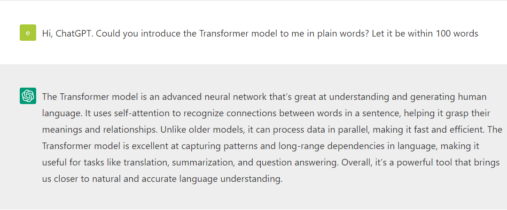
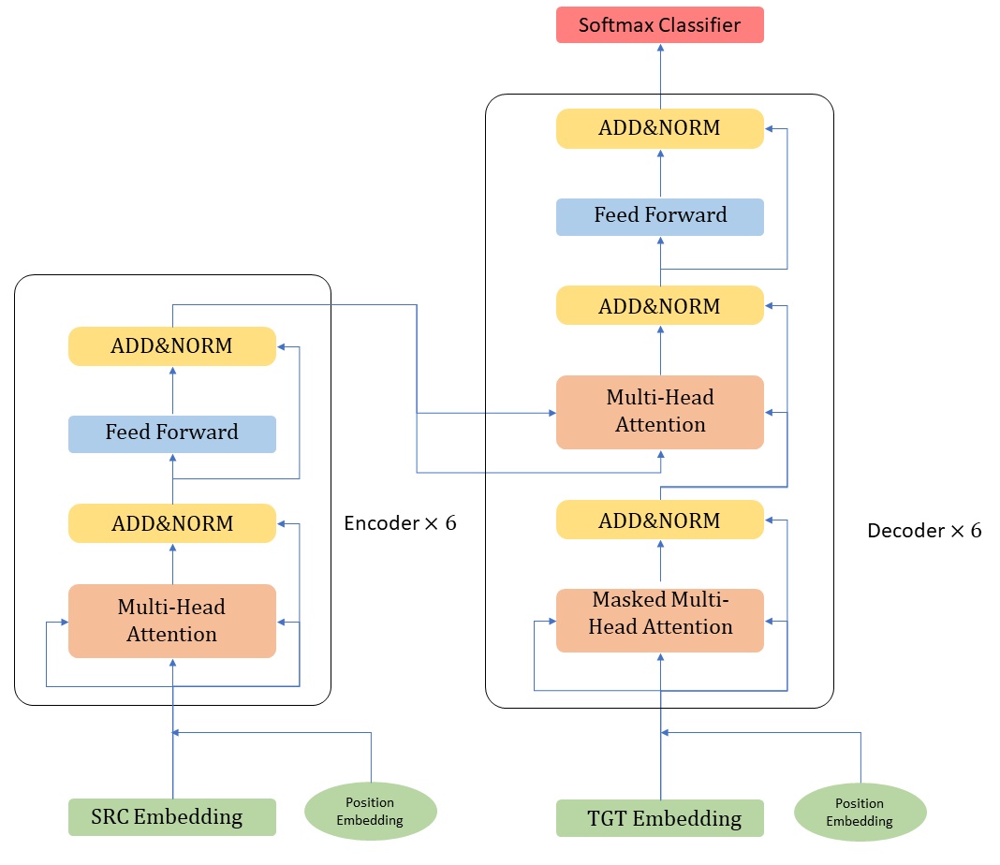

## Table of Contents
- [Table of Contents](#table-of-contents)
- [Transformer Architecture](#transformer-architecture)

Among all the deep learning models, Transformer can be the most widely talked over one thanks to the tremendous performance that ChatGPT, a Transformer-based model, has shown in being a personal assistant and chatbot. Never heard of it? Let's take a look at ChatGPT's own words.

<figure>
  <figcaption>Ask ChatGPT to introduce the Transformer model</figcaption>
  
</figure>

Transformer's application extends way out of NLP domain. As a powerful mathematical tool, it has helped us in DNA recognition, medical research and many aspects in other research area. I believe it is safe to say that one day we may all need to apply this model in our project. Thus, a solid understanding of Transformer architecture is neccesary. To this end, this blog focuses on a comprehensive introduction of Transformer.

## Transformer Architecture

In 2017, Google posted a paper named [Attention is All You Need](https://arxiv.org/abs/1706.03762v4) in arXiv bringing Transformer into history. Though Transformer follows the `seq2seq` structure (also known as `decoders and encoders`), its encoders and decoders consist of sole `self-attention` modules instead of `RNN` and `CNN` like most other NLP models. This is exactly the origin of the article title, a neural network composed entirely of `self-attention` mechanisms. Now let's take the classic Transformer as an example reviewing the unique model introduced by Transformer.

<figure>
  <figcaption>Simplified Transformer Structure</figcaption>
  
</figure>

As illustrated above, Transformer has 6 encoders and 6 decoders. Encoder 